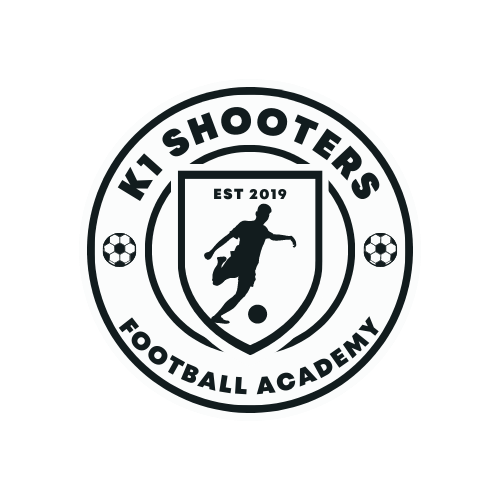

# K1 Shooters · Tactics Board

A complete football coaching board for **K1 Shooters Football Academy** — built to match (and beat) the paid tactical-board sites, with nothing locked behind a membership. Runs on a laptop and on a phone, installs like an app, works offline, and keeps your data on your own device.



## What it does

| Area | Features |
| --- | --- |
| **Teams** | Age-group teams (U7, U9, U11, U13, U15, U17 to start — add, rename, delete) each with their own players, format, kit, coach and season · the selected team drives line-ups, match day, sessions, attendance and season stats · recommended formats by age (U6–U8 4v4/5v5, U9–U10 7v7, U11–U12 9v9, U13+ 11v11) with an age-group eligibility check |
| **Players** | FC-style profiles: photo, rating badge, six attributes (pace, shooting, passing, dribbling, defending, physical) with an auto overall and radar, position and role, foot, date of birth, height, status (available / injured / suspended / away / trial), captain, guardian and phone, medical notes, coach notes · goals, assists, cards and attendance per player · rankings by rating, goals or attendance · shareable player-card PNG with the K1 crest · **players' photos appear on their tokens on the board** |
| **Board** | Full 11v11, half pitch, 9v9, 7v7, 5v5, 4v4 mini pitch, futsal and custom training grids · 8 surfaces (classic stripes, night, dark tactical, whiteboard, blueprint, turf, sand) · portrait/landscape auto-rotation for phones · overlays: thirds, five lanes with half-spaces, 18/20 zones, metre grids · pinch/scroll zoom |
| **Players & kit** | Home / away / neutral tokens with numbers and names, goalkeepers, captain badge, referee · kit presets for **K1 Shooters, Barcelona, Man City, Real Madrid, Orlando Pirates** plus 13 more (halves, stripes, hoops, sash patterns) |
| **Drawing** | Pass, run (dashed), dribble (wavy), shot, curved cross, plain line, freehand pen · zones, rectangles, ellipses, triangles, text labels · offside line (snaps to the last defender) · distance measure · eraser · colour + thickness per object |
| **Equipment** | Cones, discs, poles, flags, mannequins, hoops, ladders, hurdles, mini goals, full goals (rotatable) |
| **Formations** | 20 shapes for 11v11 (4-3-3, false 9, 4-2-3-1, 4-4-2, diamond, 4-1-4-1, 3-5-2, 3-4-3, 3-2-4-1, 2-3-5, 3-2-5, mid block, high press, low block…) + 9v9, 7v7 and futsal shapes · one tap to apply to either team, mirrored automatically |
| **Tactics** | Animated club "morphs": Barcelona 4-3-3 → 2-3-5, Man City 3-2-4-1 → 3-2-5 → 4-1-4-1, Real Madrid low block → counter, Orlando Pirates 4-2-3-1 → 3-4-3, K1's own game model, youth 7v7 / 9v9 |
| **Set pieces** | Attacking corners (near-post overload, far-post outswinger, short, train), defending corners (zonal, man, hybrid), free kicks (direct, wide delivery, defending wall), throw-in routine, kick-off, goal kicks (short build-up, long), penalties — all animated where it matters |
| **Drills** | Rondos, positional games, Y-passing, overlaps, 1v1, finishing circuits, small-sided games, transition games, pressing traps, shadow play, warm-up — with timings, player counts, equipment and coaching points |
| **Animation** | Frames morph into each other · ghosts show where players came from · captions per frame · play / loop / speed / scrub · Present mode (fullscreen, arrow keys) · export as animated GIF (WhatsApp-friendly, works offline) or video (WebM/MP4) |
| **Squad** | Roster with numbers, positions, foot, availability, captain, notes · CSV import/export · auto line-up by role · line-up card PNG · training attendance % per player |
| **Match day** | Match clock with halves / extra time / penalties · score · possession timer · events (goals, cards, subs, injuries, shots, corners, fouls…) with player and minute · stats · copy/share the report · match history · season record, top scorers, assists and cards |
| **Sessions** | Session planner with timed blocks, drill links, coaching points, five ready-made templates (pressing, possession, finishing, set pieces, MD-1) · attendance register (present / late / injured / absent) · print to PDF |
| **Save & share** | Library with thumbnails · autosave · export PNG (with K1 header), SVG, JSON · share a link that contains the whole board · full backup/restore · print |
| **App** | Installable PWA (Add to Home Screen) · offline · dark/light interface · keyboard shortcuts · touch gestures (drag, long-press, pinch) |

## Run it on your laptop

```bash
node serve.js
```

Then open <http://localhost:8790>. (Python works too: `python -m http.server 8790`.)

You can also just double-click `index.html` — everything works from a file except "Install app" and offline caching, which browsers only allow from a web address.

## Put it on your phone

**Option A — same Wi-Fi (quickest).** Run `node serve.js` on the laptop; it prints a `Phone:` address such as `http://192.168.1.23:8790` (the app's ⋮ → *Install on this device* dialog shows the same address). Open that on the phone, then:

- **iPhone:** Share → *Add to Home Screen*
- **Android:** ⋮ menu → *Add to Home screen* / *Install app*

**Option B — one file over WhatsApp.**

```bash
node build-single.js
```

Send `dist/K1-Tactics-Board.html` to your phone and open it. Everything is inside the file.

**Option C — host it free (works anywhere, best for the team).** Run `node build-site-zip.js` to make `dist/K1-Tactics-Board-site.zip`, then drag that zip onto Netlify Drop (<https://app.netlify.com/drop>) — no account needed for a temporary site, free account to keep it. You get an https address that works on any phone, tablet or laptop, anywhere; open it, *Add to Home Screen*, done. (GitHub Pages works the same way if you prefer: push the folder to a repository and enable Pages.)

Data note: boards, players and matches live in the browser storage of each device. Use **Back up everything** (⋮ menu) to move them between devices or to keep a copy.

## Icons

`assets/icon.svg` and `assets/icon-maskable.svg` are generated from the crest in `js/logo.js`:

```bash
node tools/build-assets.js
```

PNG icons for iPhone home screens: open `tools/make-png-icons.html` (through `node serve.js`) and download the four PNGs into `assets/`.

To use the **real** K1 Shooters logo image inside the app and on exports: Settings → *Upload logo*.

## Keyboard shortcuts

`V` select · `H` pan · `A` pass · `R` run · `D` dribble · `S` shot · `C` curve · `L` line · `P` pen · `Z` zone · `B` box · `O` ellipse · `T` text · `M` measure · `I` offside · `E` eraser · `Del` delete · `Ctrl+Z/Y` undo/redo · `Ctrl+D` duplicate · `Ctrl+C/V` copy/paste · `Ctrl+S` save · `Ctrl+E` export PNG · `N` new frame · `[` `]` frames · `Space` play · `F` present · `G` snap · `+ − 0` zoom · `?` help

## Project layout

```
index.html            app shell
css/app.css           styles (dark + light, phone layouts, print)
js/icons.js           icon set
js/logo.js            K1 Shooters crest (SVG)
js/kits.js            kit presets
js/formations.js      formations library
js/pitch.js           pitch geometry, themes, markings, projection
js/state.js           document model, history, selection, settings
js/setpieces.js       set-piece playbook
js/drills.js          training drills
js/tactics.js         club tactic morphs
js/render.js          SVG renderer, zoom, export
js/anim.js            frames + animation timeline
js/templates.js       instantiate playbook items, formations, team tools
js/board.js           pointer/touch interaction, tools, shortcuts
js/storage.js         localStorage, import/export, PNG/video, share links
js/squad.js           roster
js/match.js           match centre
js/session.js         session planner
js/ui.js              chrome, inspector, frames strip, dialogs
js/panes.js           side-panel content
js/app.js             bootstrap
sw.js / manifest      PWA
serve.js              zero-dependency local server
build-single.js       one-file build for sharing
tools/                icon builders
```

No frameworks, no build step, no accounts, no tracking. Your boards live in the browser's storage on each device — use **Back up everything** now and then.

— Built for K1 Shooters Football Academy · est. 2019
